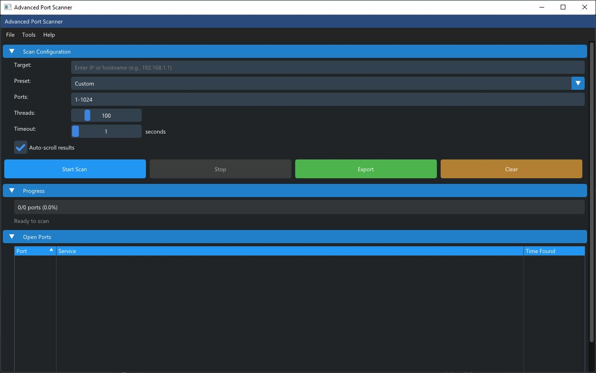

# 🔍 PortScan - Multi-threaded Port Scanner


A fast, modern multi-threaded port scanner with both CLI and GUI interfaces. Scan thousands of ports in seconds with an elegant, user-friendly interface.



## ✨ Features

- 🚀 **Multi-threaded Scanning** - Scan 1000+ ports in seconds using concurrent threads
- 🎨 **Modern GUI** - Beautiful Dear ImGui interface with real-time updates
- ⌨️ **CLI Interface** - Perfect for automation and scripting
- 🎯 **Service Detection** - Automatically identifies common services (SSH, HTTP, MySQL, etc.)
- 📊 **Color-coded Results** - Visual distinction for web, SSH, and database services
- 💾 **Export Results** - Save scan results to text or CSV files
- 🎮 **Preset Configurations** - Quick scan, full scan, web services, databases
- 📈 **Real-time Progress** - Live progress bars and statistics
- 🪶 **Lightweight** - GUI version is only ~500KB with no dependencies

## 🖼️ Screenshots

### GUI Version
- Modern dark theme with smooth 60 FPS rendering
- Color-coded results (Orange: Web, Green: SSH, Blue: Databases)
- Real-time progress tracking
- Sortable results table

### CLI Version
- Fast terminal interface
- Perfect for automation
- Detailed output with service names

## 🚀 Quick Start

### GUI Version (Recommended)

```bash
# Clone the repository
git clone https://github.com/zzleep/PortScan.git
cd PortScan/gui_imgui

# Build (automatically downloads Dear ImGui)
./build_imgui.bat    # Windows
./build_imgui.sh     # Linux

# Run
./run_gui.bat        # Windows
./PortScannerGUI     # Linux
```

### CLI Version

```bash
cd cli

# Build
./build.bat          # Windows
./build.sh           # Linux

# Run
./port_scanner 192.168.1.1 -p 1-1000
```

## 📖 Usage

### GUI Interface

1. **Launch** the application
2. **Enter target** IP address or hostname
3. **Choose preset** or specify custom ports
4. **Adjust settings** (threads, timeout)
5. **Click "Start Scan"**
6. **View results** in real-time with color coding
7. **Export** results if needed

### Command-Line Interface

```bash
# Basic scan
./port_scanner 192.168.1.1

# Specific port range
./port_scanner example.com -p 1-1000

# Multiple ports
./port_scanner 10.0.0.1 -p 80,443,8080

# All ports with more threads
./port_scanner scanme.nmap.org -p 1-65535 -t 200

# Common ports only
./port_scanner 192.168.1.1 --common

# Custom timeout
./port_scanner 10.0.0.1 -p 1-1000 --timeout 2
```

### Options

| Option | Description | Default |
|--------|-------------|---------|
| `<target>` | IP address or hostname | Required |
| `-p, --ports` | Ports to scan (e.g., `80`, `1-1000`, `80,443`) | `1-1024` |
| `-t, --threads` | Number of concurrent threads | `100` |
| `--timeout` | Socket timeout in seconds | `1` |
| `--common` | Scan only common ports | `false` |

## 🛠️ Building from Source

### Prerequisites

**All Versions:**
- C++17 compatible compiler (GCC 7+, Clang 5+, or MSVC 2017+)
- Make (optional, for Makefile builds)

**Windows:**
- MinGW-w64 or Visual Studio

**Linux:**
- Build essentials: `sudo apt-get install build-essential`

### Build Instructions

**GUI Version:**
```bash
cd gui_imgui
# Windows
build_imgui.bat

# Linux
chmod +x build_imgui.sh
./build_imgui.sh
```

**CLI Version:**
```bash
cd cli
# Windows
build.bat

# Linux
chmod +x build.sh
./build.sh
```

## 🎯 Preset Configurations

The GUI includes convenient presets:

- **Quick Scan** - Common ports (FTP, SSH, HTTP, etc.)
- **Standard Scan** - Ports 1-1024
- **Full Scan** - All ports 1-65535
- **Web Services** - HTTP, HTTPS, proxies
- **Database Ports** - MySQL, PostgreSQL, MongoDB, Redis

## 📊 Performance

- **Sequential scanning**: ~10 minutes for 1000 ports
- **100 threads**: ~10-30 seconds for 1000 ports
- **200 threads**: ~5-15 seconds for 1000 ports

*Performance varies based on network conditions and target responsiveness*

## 🏗️ Architecture

### Project Structure

```
PortScan/
├── cli/              # Command-line interface
├── gui_imgui/        # Dear ImGui GUI version
├── imgui/            # Dear ImGui library (auto-downloaded)
├── docs/             # Additional documentation
├── LICENSE           # MIT License
├── README.md         # This file
└── CONTRIBUTING.md   # Contribution guidelines
```

### Technologies

- **C++17** - Modern C++ features
- **Dear ImGui** - Immediate mode GUI framework
- **DirectX 11** - Hardware-accelerated rendering (Windows)
- **OpenGL** - Cross-platform rendering (Linux)
- **Winsock2 / BSD Sockets** - Network operations
- **C++ Standard Library** - Threading, async I/O

## 🤝 Contributing

Contributions are welcome! Please read [CONTRIBUTING.md](CONTRIBUTING.md) for details on our code of conduct and the process for submitting pull requests.

### Areas for Contribution

- UDP port scanning
- IPv6 support
- Service version detection
- Additional export formats (JSON, XML)
- macOS support improvements
- Unit tests
- Documentation improvements

## 📝 License

This project is licensed under the MIT License - see the [LICENSE](LICENSE) file for details.

## ⚠️ Legal & Ethical Use

**IMPORTANT:** This tool is for educational purposes and authorized security testing only.

- ✅ Only scan networks and systems you own
- ✅ Obtain written permission before scanning
- ✅ Respect network resources and rate limits
- ❌ Unauthorized scanning may violate laws (e.g., CFAA in the US)

**Users are responsible for ensuring compliance with all applicable laws and regulations.**

## 🙏 Acknowledgments

- [Dear ImGui](https://github.com/ocornut/imgui) - Excellent immediate mode GUI library
- The security and networking community for inspiration

## 📧 Contact

- **Issues**: [GitHub Issues](https://github.com/zzleep/PortScan/issues)
- **Pull Requests**: [GitHub PRs](https://github.com/zzleep/PortScan/pulls)

## 🌟 Star This Repository

If you find this project useful, please consider giving it a star! ⭐

---

